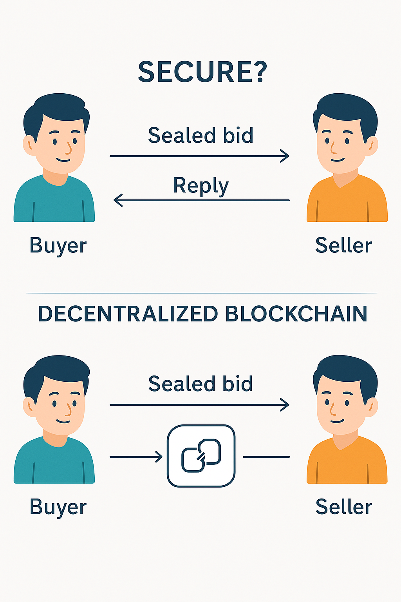

# AuctoSafe: Blockchain-Based Bidding System



## Overview

AuctoSafe is a privacy-preserving blockchain-based bidding system that ensures secure, transparent, and tamper-proof bidding processes. Built using Django and a custom blockchain implementation, AuctoSafe provides a robust platform for creating tenders, submitting bids, and evaluating results with complete privacy and security.

## Key Features

- **Enhanced Privacy**: Implements deniable matchmaking encryption (DME) to provide unparalleled privacy protection for both messages and identities.
- **Immutable Records**: Utilizes blockchain technology to ensure bidding records are unchangeable and permanently stored in a distributed ledger.
- **Transparent Bidding**: Offers a transparent evaluation process that ensures fair selection while maintaining the privacy of all participants.
- **Role-Based Access**: Separate interfaces for Tender Officers (administrators) and Bidders with appropriate permissions.
- **Secure Authentication**: Robust user authentication and session management.
- **Modern UI**: Sleek dark-themed interface with smooth animations and responsive design.

## System Architecture

AuctoSafe uses a custom blockchain implementation with the following components:

1. **Blockchain Core**: Handles the creation and management of blocks in the chain.
2. **Deniable Matchmaking Encryption (DME)**: Provides deniability for both messages and identities.
3. **Chameleon Hash Function**: Makes fake messages and identities indistinguishable from real ones.
4. **Web Interface**: Django-based frontend for user interaction.

## User Roles

### Tender Officer
- Create and manage tenders
- View submitted bids
- Evaluate tenders and select winners
- Access dashboard with statistics

### Bidder
- Register a new account
- View available tenders
- Submit bids for open tenders
- View bid status and results

## Installation

### Prerequisites
- Python 3.8+
- Django 4.2+
- Other dependencies listed in requirements.txt

### Setup Instructions

1. Clone the repository:
   ```
   git clone https://github.com/yourusername/AuctoSafe.git
   cd AuctoSafe
   ```

2. Create a virtual environment (optional but recommended):
   ```
   python -m venv venv
   source venv/bin/activate  # On Windows: venv\Scripts\activate
   ```

3. Install dependencies:
   ```
   pip install -r requirements.txt
   ```

4. Run migrations:
   ```
   python manage.py migrate
   ```

5. Start the development server:
   ```
   python manage.py runserver
   ```

6. Access the application at http://127.0.0.1:8000/

## Usage Guide

### For Tender Officers

1. **Login**: Use the Officer Login with credentials (default: username: admin, password: admin).
2. **Create Tender**: Fill in the tender details including title, description, open/close dates, and base amount.
3. **Evaluate Bids**: Review submitted bids and select winners based on the lowest bid.
4. **View Results**: Access the winner selection page to see the results and savings.

### For Bidders

1. **Register**: Create a new bidder account with your company details.
2. **Login**: Access your account using your credentials.
3. **View Tenders**: Browse available tenders that are currently open.
4. **Submit Bids**: Place bids on tenders of interest.
5. **Check Results**: View the status of your bids and tender results.

## Security Features

- **Blockchain Integrity**: All transactions are stored in a blockchain, ensuring immutability.
- **Encryption**: Sensitive data is encrypted before being added to the blockchain.
- **Deniable Encryption**: The system can present fake information to coercers while preserving actual data.
- **Session Management**: User sessions are securely managed to prevent unauthorized access.

## Technical Implementation

- **Frontend**: HTML, CSS, JavaScript, Bootstrap
- **Backend**: Django (Python)
- **Database**: SQLite (default), compatible with PostgreSQL and MySQL
- **Blockchain**: Custom implementation in Python

## Project Structure

```
BlockchainBiddingApp/
├── BlockchainBidding/       # Django project settings
├── BlockchainBiddingApp/    # Main application
│   ├── static/              # Static files (CSS, JS, images)
│   ├── templates/           # HTML templates
│   ├── Blockchain.py        # Blockchain implementation
│   ├── Block.py             # Block class definition
│   ├── views.py             # View functions
│   ├── urls.py              # URL routing
│   └── ...
└── manage.py                # Django management script
```

## Troubleshooting

- **Blockchain File Not Found**: If you encounter errors related to missing blockchain files, ensure the application has write permissions to create the necessary files.
- **Session Issues**: If login doesn't work, check that the session file is writable.
- **Database Errors**: Run migrations if you encounter database-related errors.

## Future Enhancements

- Integration with external blockchain networks
- Mobile application support
- Advanced analytics and reporting
- Multi-language support
- Enhanced notification system

## Contributing

Contributions are welcome! Please feel free to submit a Pull Request.

## License

This project is licensed under the MIT License - see the LICENSE file for details.

## Acknowledgments

- Developed by Team RRR (Rishabh, Rahul, Raeez)
- Special thanks to all contributors and testers

## Contact
No one as of now.

---

© 2025 AuctoSafe. All Rights Reserved.
